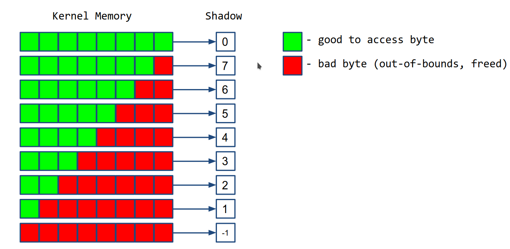
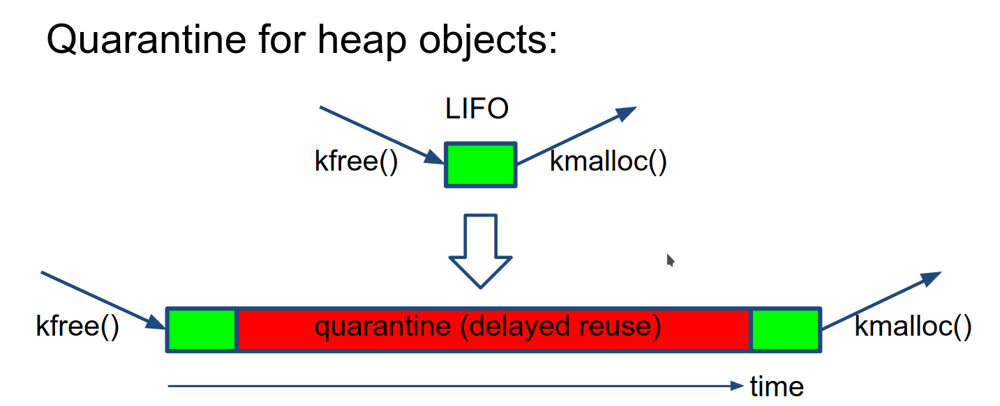

# Dynamic Program analysis

## What is Dynamic program analysis ?
It is analysis of the properties of a running program. The properties are 
1.  Bugs 
2.  performance 
3.  code coverage
4.  data flow 

These properties are valid for single execution 

## What is static program analysis ?
It is analysis of properties of program code. 
These properties are valid for all execution. 

## Why Dynamic program analysis is better than static ? 

1.  Static program analysis is better for True positives, but it also generates
    alot of false positives. 

1.  Dynamic program analysis is better to avoid false positives, hence the reports 
    are more true positives than static. 

The problem with dynamic program analysis is that the coverage is not that good. 

## DIY Tools

Kernel provides some tools for dynamic program analysis, 
Enable these configurations in the kernel config and kernel will analyse it for 
us. If anything fails then we get a bug report in the console. 

1.  CONFIG_DEBUG_LIST=y , adds debug checks for link listss 
2.  CONFIG_FORTIFY_SOURCE=y, finds out of bounds access for simple codes 
3.  BUG_ON(condition) Check if your assumptions in code are true.
4.  WARN_ON(condition) Check if your assumptions in code are true.
1.  scrpits/decode_stacktrace.sh - this is usefull for finding line numbers 
    from kernel oops. 

There are more configs which can be loaded full list is 
here - https://events.linuxfoundation.org/wp-content/uploads/2022/10/Dmitry-Vyukov-Dynamic-program-analysis_-LF-Mentorship.pdf (see page 23-25)

## KASAN (Kernel Address Sanatizer)

It is used to detect these type of bugs in the kernel 
-   Out-Of-Bounds
-   Use-After-Free
-   Heap, stack, globals

It can be enabled in the kernel by setting config CONFIG_KASAN=y

### How KASAN works ? 

1.  Shadow bytes
    For every 8 bytes of kernel memory, it allocates 1 shadow byte. This shadow 
    byte contains 0 if all bytes can be access (good bytes), 7 if 1 byte out of 8 bytes
    cannot be accessed (bad byte) and -1 if all the bytes cannot be accessed. 

    

    The shadow bytes are stored in a virtual memory section called KASAN shadow.

2.  Red-zones around heap objects (to detect out-of-bound errors)

    
    
    If we try to access the redzones then bug is triggered. 

3.  Quarantine for heap objects (to detect Use-After-Free)
    
    This delays the reuse of heap blocks, so if the kernel tries to access 
    this block in quarantine then it is Use-After-Free bug. 

    

4.  Compiler instrumentation: shadow check before memory access  

    Compiler adds a code check before any memory access which checks the shadow
    byte is appropriate (i.e 0 for 8 byte access & 4 for 4 byte access), 
    if incorrect then it is a bug.  

This has an overhead, causing 2x slowdown and 2x more memory usage. 

## Conclusion 

In kernel development, 

1.  enable DEBUG_XXX, LOCKDEP, KASAN kernel configuration files
1.  For new code, try to insert BUG_ON / WARN_ON
1.  add/run kernel tests
1.  Use scripts/decode_stacktrace.sh to debug 
