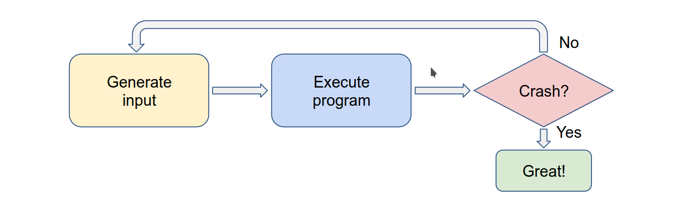
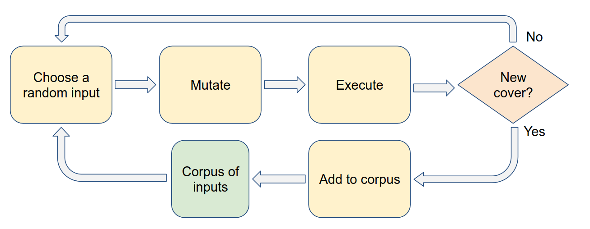
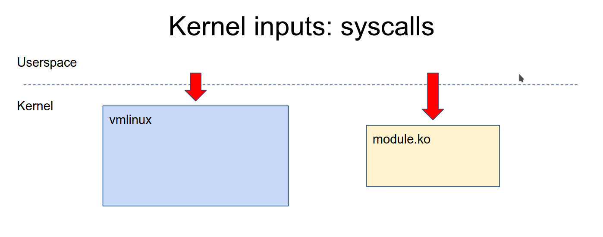
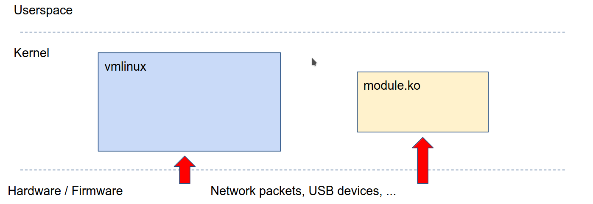

# Fuzzing Linux Kernel 

## What is Fuzzing ? 
Feeding random inputs untill program crashes. 

for Fuzzing we need to answer these questions 

1.  How do we execute the program ? 
1.  How do we inject inputs ?
1.  How do we generate inputs ?
1.  How do we detect program crashes ?
1.  How do we automate the whole process ? 

except for #3 all others depend on the program that we are Fuzzing.

## How do we generate inputs ? 
Just generating random data does not always work, 

for example: if we are fuzzing an xml parser, the just to generate header 
`<xml` it will take ~2^32 guesses. 

So random data does not always work 

So there are 3 approaches to generate better inputs 
1.  Structured inputs (structure-aware-fuzzing)
    -   We build a grammar for inputs and fuzz them. 
2.  Guided generation (coverage-guided-fuzzing)
    
    -   We use an existing pool of corpus input or a random input
    -   We mutate (change) it 
    -   We use it as an input and execute the program
    -   We check if covers new code ? 
        - If yes then we add it to Corpus inputs pool 
        - else we start again from random input. 
3.  Collecting corpus samples and mutating them 
    -   We can scrape the internet and collect inputs.
    -   These inputs can be mutated and fed into the program. 

These approaches can be combined with each other to create new inputs for fuzzing.

## Kernel fuzzing   

### How to inject inputs to kernel ?
To inject inputs we need to understand what inputs does kernel have. 

#### What kind of inputs does kernel have 

1.  syscalls
    
    -   We can use program which calls syscalls to inject syscall input.

2.  external inputs i.e usb dev, network packets, firmware etc. 

    
    -   We can use userspace or hypervisor/emulator to give external inputs
        
        for ex: 
        1.  for usb we can use `/dev/raw-gadget` + Dummy UDC 
        1.  for network we can use `/dev/tun`

### How to generate inputs for kernel ?

Kernel does not accept data as inputs it accepts syscalls. 

Most syscalls are used as API i.e 
-   It is always a sequence of calls 
-   Argumets to the calls are structured 
-   Return values or struct are used as inputs in next calls 

sequence of calls in the input to the kernel

API-aware fuzzing 
-   inputs are api call sequences 
-   these are generated and mutated accordingly

External inputs are also similar to API's. 

So most common input structures are 
1.  API 
1.  API with callbacks 
1.  Scripts 
1.  USB-like stuff

## Tools used for Fuzzing the kernel 

There are other tools but most common are 
1.  Trinity - finds less bugs but easier to deploy
2.  Syzkaller - goes deeper but finds more bugs and easier to extend

## Approaches to fuzzing kernel  

-   Building kernel code as userspace program and fuzzing that
    -   Works for code that is separable from kernel, but some kernel code 
        cannot be separated.
-   Reusing a userspace fuzzer
    -   Works for fuzzing blob-like inputs, but most kernel inputs are not blobs
-   Using syzkaller
    -   Good for fuzzing kernel API 
-   Writing a fuzzer from scratch
    -   Only benefits when the interface is not API-based.

## Tips for using syzkaller
1.  Don't just fuzz mainline with the default config
    -   fuzz with different configs
    -   fuzz a small number of related syscalls 
        i.e fuzz 3 or 4 syscall related to networking
    -   Fuzz distro kernels

1.  Build your fuzzer on top of syzkaller, extend syzkaller rather than writing 
    your own fuzzer. 

1.  Reuse parts of the syzkaller for your fuzzer. 

