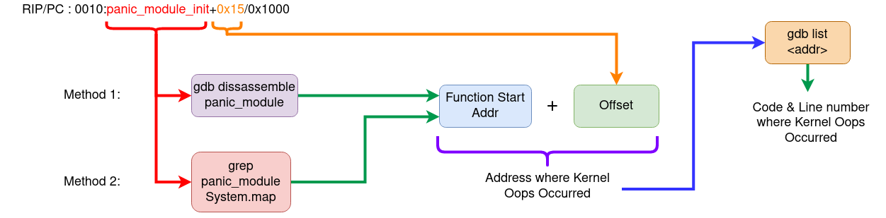

# Understanding Linux kernel Oops 

Kernel panic is when there is a fatal error from which the kernel cannot recover.
So it forces the system into controlled system hang/reboot.

There are 2 types of panics 
1. Hard panics (Aiee!)
2. Soft panics (Oops!)

## Oops 
On faulty code execution or when an exception occurs kernel throws Oops. 

When Oops occurs it dumps the message on the console. Message contains the 
CPU registers & the processor status of when the Oops occured. 

The process that triggered the Oops gets killed ungracefully. There is a chance
that the system may not resume from the Oops.

## Understanding Oops Dump 

We will be using the sample Oops dump below, this oops is generated from 
the kernel panic module from the Task of the mentorship.

```
[   96.106469] panic_msg: loading out-of-tree module taints kernel.
[   96.106525] panic_msg: module verification failed: signature and/or required key missing - tainting kernel
[   96.106710] Panic module init.
[   96.106713] BUG: kernel NULL pointer dereference, address: 0000000000000001
[   96.106718] #PF: supervisor read access in kernel mode
[   96.106721] #PF: error_code(0x0000) - not-present page
[   96.106723] PGD 0 P4D 0
[   96.106728] Oops: 0000 [#1] SMP NOPTI
[   96.106732] CPU: 1 PID: 7403 Comm: insmod Kdump: loaded Tainted: G       	OE 	5.15.0-72-generic #79~20.04.1-Ubuntu
[   96.106737] Hardware name: ASUSTeK COMPUTER INC. ROG Zephyrus G14 GA401IH_GA401IH/GA401IH, BIOS GA401IH.212 03/14/2022
[   96.106740] RIP: 0010:panic_module_init+0x15/0x1000 [panic_msg]
[   96.106749] Code: Unable to access opcode bytes at RIP 0xffffffffc1470feb.
[   96.106752] RSP: 0018:ffffaa368299bbb8 EFLAGS: 00010246
[   96.106755] RAX: 0000000000000012 RBX: 0000000000000000 RCX: 0000000000000027
[   96.106758] RDX: 0000000000000000 RSI: ffffaa368299ba00 RDI: ffff88d4d7460588
[   96.106761] RBP: ffffaa368299bbb8 R08: ffff88d4d7460580 R09: 0000000000000001
[   96.106763] R10: 696e6920656c7564 R11: 6f6d2063696e6150 R12: ffffffffc1471000
[   96.106766] R13: ffff88cfd734d390 R14: 0000000000000000 R15: ffffffffc1884000
[   96.106768] FS:  00007f241ee73740(0000) GS:ffff88d4d7440000(0000) knlGS:0000000000000000
[   96.106772] CS:  0010 DS: 0000 ES: 0000 CR0: 0000000080050033
[   96.106775] CR2: ffffffffc1470feb CR3: 000000023ecac000 CR4: 0000000000350ee0
[   96.106778] Call Trace:
[   96.106780]  <TASK>
[   96.106784]  do_one_initcall+0x48/0x1e0
[   96.106791]  ? __cond_resched+0x19/0x40
[   96.106797]  ? kmem_cache_alloc_trace+0x15a/0x420
[   96.106804]  do_init_module+0x52/0x230
[   96.106810]  load_module+0x1294/0x1500
[   96.106819]  __do_sys_finit_module+0xbf/0x120
[   96.106823]  ? __do_sys_finit_module+0xbf/0x120
[   96.106830]  __x64_sys_finit_module+0x1a/0x20
[   96.106835]  do_syscall_64+0x5c/0xc0
[   96.106840]  ? exit_to_user_mode_prepare+0x3d/0x1c0
[   96.106845]  ? syscall_exit_to_user_mode+0x27/0x50
[   96.106849]  ? __x64_sys_mmap+0x33/0x50
[   96.106853]  ? do_syscall_64+0x69/0xc0
[   96.106857]  ? syscall_exit_to_user_mode+0x27/0x50
[   96.106861]  ? __x64_sys_read+0x1a/0x20
[   96.106865]  ? do_syscall_64+0x69/0xc0
[   96.106870]  ? irqentry_exit+0x1d/0x30
[   96.106874]  ? exc_page_fault+0x89/0x170
[   96.106879]  entry_SYSCALL_64_after_hwframe+0x61/0xcb
[   96.106885] RIP: 0033:0x7f241efa0a3d
[   96.106889] Code: 5b 41 5c c3 66 0f 1f 84 00 00 00 00 00 f3 0f 1e fa 48 89 f8 48 89 f7 48 89 d6 48 89 ca 4d 89 c2 4d 89 c8 4c 8b 4c 24 08 0f 05 <48> 3d 01 f0 ff ff 73 01 c3 48 8b 0d c3 a3 0f 00 f7 d8 64 89 01 48
[   96.106894] RSP: 002b:00007ffdbfab5128 EFLAGS: 00000246 ORIG_RAX: 0000000000000139
[   96.106899] RAX: ffffffffffffffda RBX: 000055fd2f8b4780 RCX: 00007f241efa0a3d
[   96.106903] RDX: 0000000000000000 RSI: 000055fd2e243358 RDI: 0000000000000003
[   96.106906] RBP: 0000000000000000 R08: 0000000000000000 R09: 00007f241f0a3180
[   96.106909] R10: 0000000000000003 R11: 0000000000000246 R12: 000055fd2e243358
[   96.106912] R13: 0000000000000000 R14: 000055fd2f8b7b40 R15: 0000000000000000
[   96.106918]  </TASK>
```
Let's try to understand the Oops dump.

1.  `BUG: kernel NULL pointer dereference, address: 0000000000000001`
    -   This indicates why the kernel crashed i.e it was because of NULL pointer
        dereference. 

2.  `IP:`
    -   IP shows the address of the instruction pointer. 
        The above dump does not have IP. So in some cases IP maybe missing.

3.  `Oops: 0000 [#1] SMP NOPTI`
    -   `0000` - is the error code value in Hex , where 
        1.  bit 0 - 0 means no page found, 1 means protection fault 
        2.  bit 1 - 0 means read, 1 means write
        3.  bit 2 - 0 means kernelspace, 1 means userspace

        The above code denotes that while reading there was no page found in 
        kerenelspace i.e NULL pointer dereference.

    -   `[#1]` - Number of Oops occured. There can be multiple Oops as cascading
        effect. 1 Oops occured.

4.  `CPU: 1 PID: 7403 Comm: insmod Kdump: loaded Tainted: G`
    -   `CPU 1` - Which CPU the error occured
    -   `Tainted: G` - Tainted flag

        1.  P, G — Proprietary module has been loaded.
        1.  F — Module has been forcibly loaded.
        1.  S — SMP with a CPU not designed for SMP.
        1.  R — User forced a module unload.
        1.  M — System experienced a machine check exception.
        1.  B — System has hit bad_page.
        1.  U — Userspace-defined naughtiness.
        1.  A — ACPI table overridden.
        1.  W — Taint on warning.

        Ref: https://github.com/torvalds/linux/blob/master/kernel/panic.c

        This shows that the proprietary module has been loaded. 

5.  `RIP: 0010:panic_module_init+0x15/0x1000 [panic_msg]`
    -   `RIP` - CPU register containing addr of the instruction getting executed. 
    -   `0010` - Code segment register value. 
    -  `panic_module_init+0x15/0x1000` - <symbol> + offset/ length  

6.  CPU register contents   
    ```
    RSP: 0018:ffffaa368299bbb8 EFLAGS: 00010246
    RAX: 0000000000000012 RBX: 0000000000000000 RCX: 0000000000000027
    RDX: 0000000000000000 RSI: ffffaa368299ba00 RDI: ffff88d4d7460588
    RBP: ffffaa368299bbb8 R08: ffff88d4d7460580 R09: 0000000000000001
    R10: 696e6920656c7564 R11: 6f6d2063696e6150 R12: ffffffffc1471000
    R13: ffff88cfd734d390 R14: 0000000000000000 R15: ffffffffc1884000
    FS:  00007f241ee73740(0000) GS:ffff88d4d7440000(0000) knlGS:0000000000000000
    CS:  0010 DS: 0000 ES: 0000 CR0: 0000000080050033
    CR2: ffffffffc1470feb CR3: 000000023ecac000 CR4: 0000000000350ee0
    ```
7.  `Stack:` - This is the stack trace. 
    -   But as you can see it is missing from the dump. This might be because 
        the kernel is not configured correctly, but I am currently unable 
        to get the exact config which enables stack.

8.  `Code: 5b 41 5c c3 66 0f 1f 84 00 00 00 00 00 f3 0f 1e fa 48 89 f8 48 89 f7
    48 89 d6 48 89 ca 4d 89 c2 4d 89 c8 4c 8b 4c 24 08 0f 05 <48> 3d 01 f0 ff 
    ff 73 01 c3 48 8b 0d c3 a3 0f 00 f7 d8 64 89 01 48`
    -   This is a hex-dump of the section of machine code that was being run 
        at the time the Oops occurred.

## Debugging the Oops 

The aim here is to find out the Address where the Oops occured, so that 
we can use GDB to get the exact line of the code where the kernel Oops occured.

### Method 1: Using the Oops dump + GDB

#### Logic behind this method
1.  RIP/PC - Instruction pointer or Program counter will give the instruction address
    and offset. Addresss + offset = Instruction Addr where Oops occured. 
1.  Use GDB to dissassemble the function (this we get in the RIP line of Oops dump)
1.  Once we get the address then use GDB `list` to get to the line of the code.  

#### Steps: 
1.  Load the module in GDB 
2.  Add the symbol-file in GDB 
3.  Disassemble the function mentioned in the `RIP` section in the above dump. 
4.  To get the exact line we use (RIP instruction addr + offset)
5.  Then we run list *(RIP instruction addr + offest) to give the offending code. 


Honestly this method seems to be a bit complex, a simpler way would be to use
`addr2line` to convert the address to line. For more see the video 
- https://youtu.be/X5uygywNcPI?t=1159

### Method 2: Using System.map + GDB

System.map is the list of symbols and their addr in the kernel.

#### Logic behind this method
1.  Using the function name from the Oops dump, get the symbol address from the
    System.map. we call it Fun_Addr
2.  Get the exact instruction address by Fun_Addr + Offset (from oops dump) 
3.  Dissassemble the function to get to the exact instruction where it failed.
4.  To get to the line number use GDB `list` & pass it Fun_Addr + Offset.

#### Steps 
1.  Identify the PC/RIP (Addr & offset) from the Oops dump.
1.  Identify the function where the Oops occured from the Oops dump. 
1.  Get the exact instruction address by Fun_Addr + Offset (from oops dump) 
1.  Dissassemble the function to get to the exact instruction where it failed.
1.  To get to the line number use GDB `list` & pass it Fun_Addr + Offset.

## Ways of Dissassembling 

1.  Using `objdump`
2.  Using `gdb`

#### objdump
```
objdump -D -S --show-raw-insn --prefix-addresses --line-numbers vmlinux 
```

#### gdb 
```sh
# Run gdb
gdb –silent vmlinux
# Inside gdb run the command 
dissassemble <function-name>
```

## TLDR; Summary



#### References 
Ref: https://www.opensourceforu.com/2011/01/understanding-a-kernel-oops/
Ref: https://sanjeev1sharma.wordpress.com/tag/debug-kernel-panics/

