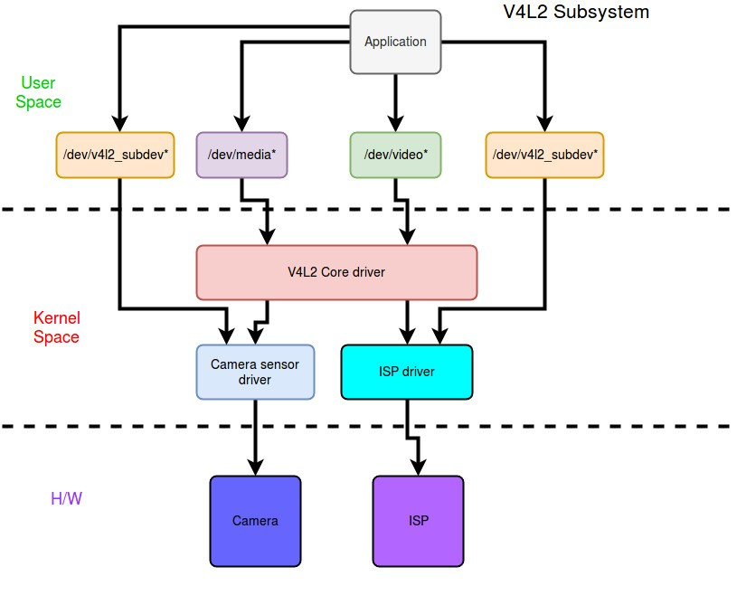

# Camera Driver Architecture
1. Application - The user application which captures video or pictures
2. V4L2 Core driver - It is a  standard or collection of many different ioctl’s for capturing video(it maps functionality to ioctl’s)
3. Camera Sensor driver - Responsible for low level management of the camera sensor hardware.
4. ISP driver - Responsible for low level management of the ISP hardware.
