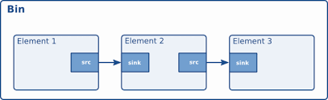
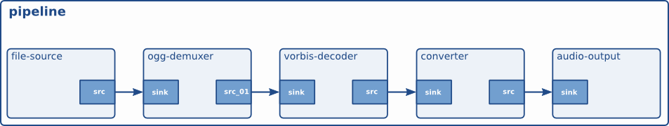

# Gstreamer

1. It is mainly used in multimedia application is in userspace
2. It uses V4L2 ioctl’s for low level interaction with the camera driver.
3. It has plugins for extra features into Gstreamer.
4. It has pipeline architecture which reduces processing time, by capturing another frame at same time when you are processing a frame.

# Gstreamer Internals
**Elements** : 
Elements are the basic building blocks for a media pipeline.An Element has one specific function. Which can be reading a data from a file, decoding data or outputting this data. By chaining together several elements We create a pipeline that can do specific task. 
In elements, We have sink elements and source elements.

**Source elements** generate data for use by a pipeline, for example reading from disk.Source elements do not accept data, they only generate data.

**Sink elements** are end points in a media pipeline. They accept data but do not produce anything.
Basic concept of media handling in Gstreamer 



Here the output of the source element will be used as input for the filter-like element.The filter-like element will do something with the data and send the result to the final sink element.

• **Pads** : 
Pads are an element's input and output, where you can connect other elements. Pads can be port or plugs.

• **Bins** : 
A bin is a container for a collection of elements.

• **Pipelines** :
Elements arranged in particular sequence.



**GStreamer** provides several mechanisms for communication and data exchange between the application and the pipeline.


• **Buffers** are objects for passing data between elements in the pipeline. They travel from source to sinks.

• **Events** can travel upstream and downstream. Application to elements.

• **Messages** are used to transmit information like if errors occurred from elements to application layer.

• **Queries** from app to pipeline.

# Gstreamer tools

**1. Gst-launch-1.0** -
Element types are separated by exclamation marks (!).
GStreamer tries to link the output of each element to the input of the element appearing on its right in the description. If more than one input or output Pad is available, the Pad Caps are used to find two compatible Pads.
By adding a dot plus the Pad name after the name of the element, we can specify the pad directly.

**2. Gst-inspect-1.0** -
This tool is used To know about elements. Basically pad templates and Elements properties is needed. 

**3. Gst-discoverer-1.0** -
To extract elements and to know their properties this tool is used.

# Practicals

1. Resize and Crop images or videos 

To approach this we need to

• First search for the plugins which is needed to crop our image or video.
• Secondly We need to find information about those plugins.
• Then finally We will see How to Use it.

**So to Resize video**

We have 3 plugins


**1. videobox**

This plugin crops or enlarges the image. It takes 4 values as input, a top, bottom, left and right offset. 

**2. Videoscale**

This element resizes video frames.

**3. Videocrop**

This element crops video frames, meaning it can remove parts of the picture on the left, right, top or bottom of the picture and output a smaller picture than the input picture, with the unwanted parts at the border removed. Its main goal is to support a multitude of formats as efficiently as possible. Unlike videbox, it cannot add borders to the picture and unlike videbox it will always output images in exactly the same format as the input image.

**For Image** : 

Command :
```sh 
gst - launch - 1.0 v4l2src num - buffers=1 !  videobox top=100 bottom =100 left =100 right= 100 ! jpegenc ! filesink location =./test.jpg
```
Here Elements are v4l2src jpgenc and filesink 

They all create pipeline

> Here we should keep in mind that the sequence of the elements matters as it follows a pipeline structure the output of one will be the input of another element. 

**For video** :

Command : 
```sh
gst - launch - 1.0 v4l2src ! videobox top=0 bottom = 0 left = 0 right = 0 ! xvimagesink
```
2. Add Time overlay for video :

Plugin used is Timeoverlay 

Command :
```sh
gst - launch-1.0 v4l2src ! timeoverlay halignment=right valignment=bottom text="Stream time:" shaded-background=true ! xvimagesink
```
•**Text overlay for video** :

Plugin used is textoverlay 

Command :
```
gst - launch - 1.0 v4l2src ! textoverlay text="Hello" valignment=top halignment=left font-desc="Sans, 72" ! xvimagesink
```
