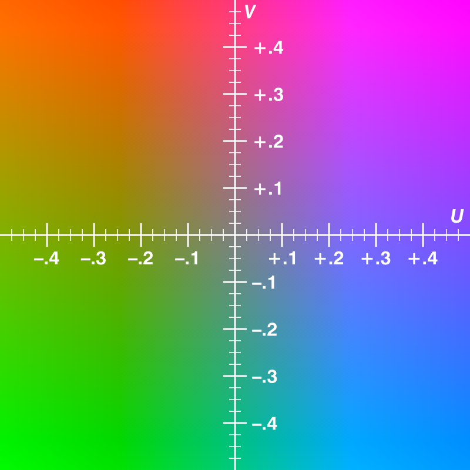
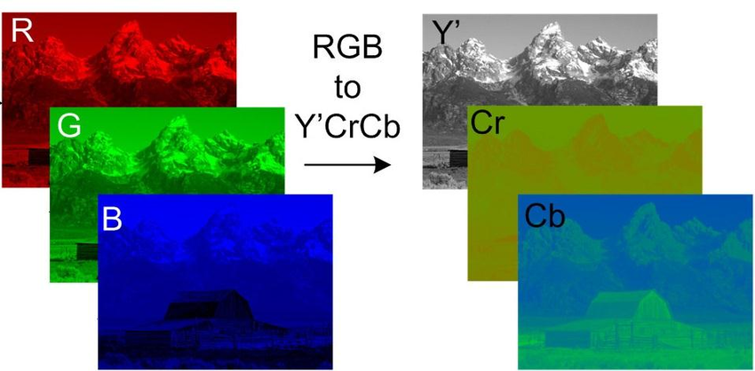

## Image 
An image is a collection of pixels.

### RGB

* It is an additive colour model.
* Various colours can be produced by adding R G B in different quantities.
* It is stored using 8 bits.
* When the proportion of all three is same grey colour is obtained , when 0, white and when it is 100 the black is obtained.

### YUV

*  It is a colour model which has 1 luminance-Y and 2 chrominance-UV components.
*  It needs less memory.
*  Y=U+V
* Y is the brightness of the image while U and V are the color components of the image.

## RGB vs YUV 

The above image shows how the same image is represented in both RGB vs YUV formats.

### Raw image
Unprocessed image directly taken from the image sensor.
