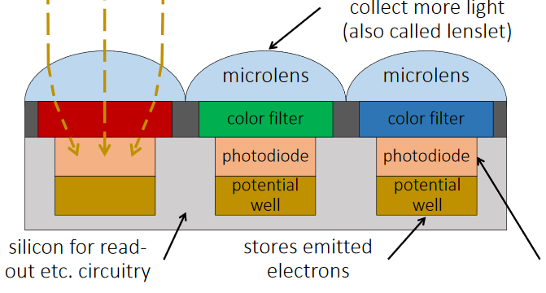

## Working of Camera

1. The light enters when shutter of the camera gets opened through lens and then it is stored in the form of photons. 
2. Then these photons are converted into some electric signals having certain range of voltage say 0 to 5 V. 
3. The brighter the light, the more photons are collected, and a higher electrical charge is generated. 
4. Initially image is obtained in black & white form. 
5. In order to make this image colorful a particular color filter is put on top of the sensor so that only one color passes through. Hence one sensor provides output for only one color.
6. Filtering is done by Bayer's Transformation.
7. In Bayer's Transformation each pixel has 4 color sensors in which 2 are of green and one of red and blue each, G is double because green is more sensible to human eye.
