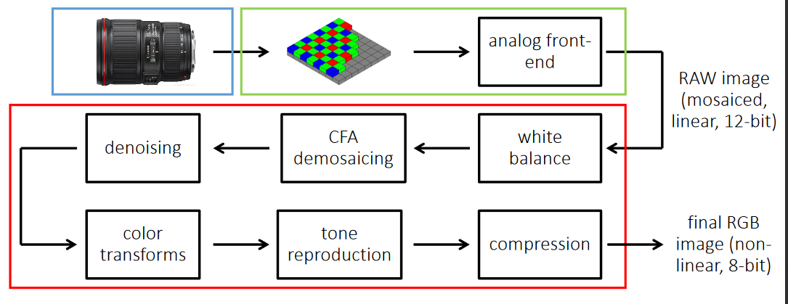

## Image Processing Pipeline 
Image processing Pipeline is a method used to convert an image into digital form while performing some operations on them, in order to get an enhanced image or to extract some useful information.

**White Balancing:** 
White balancing (WB) is the process of removing unrealistic color, so that the objects that appear white are rendered white in the image. There are two different methods of white balancing: 
1. Manual White balance
2. Auto White balance 

**Demosiacing:** 
In short demosiacing can be defined as the process of converting independent R, G, or B to form RGB as a whole.

**Denoising:**
Removal of noise(here unwanted pixels) from the image is defined as denoising. There are two different methods of denoising: a)Mean filtering b)Median filtering.

**Tone Reproduction:** 
Tone reproduction can be defined as the changing of tones or we can say producing different shades in brightness of an image. It is also called as gamma correction.

**Auto Exposure:-**
Exposure is the amount of light that reaches a camera which will define how bright and dark your picture is. This can be controlled by shutter speed and aperture.
In an automated digital camera system that sets the aperture and shutter speed, based on the external lighting conditions for the photo. The camera measures the light in the frame and then automatically locks the camera's settings to ensure proper exposure

**Auto Focus:-**
It focuses on the particular feature in the image, by using the distance between the object and the camera and change the focal length.

**Auto White Balance:-**
White balance is the process of removing unrealistic colour , so that objects which appear white in person are rendered white in your photo.It uses a reference or the actual colored image to remove the unrealistic color

**Color Correction:-**
Color used by camera sensors are different to that what an eye can see so it uses some reference to correct the color

**Gamma Correction –**
It is used to correct the amount of light intensity captured because every time the camera capture the image will not be with correct intensity.

**Color Space Conversion –**
It is just the conversion from RGB to YUV
