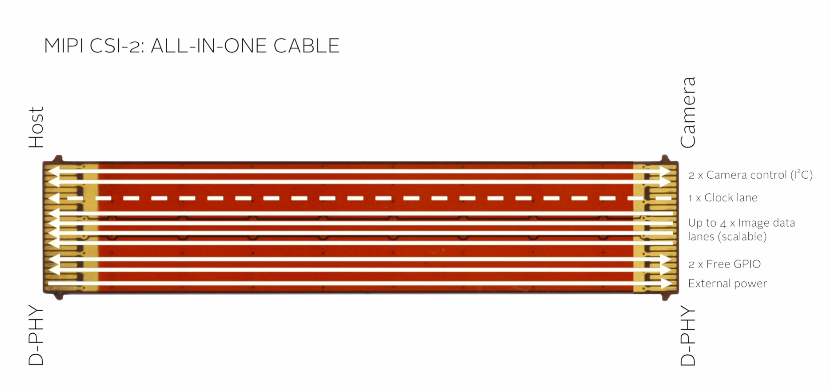

## MIPI

* MIPI is an alliance for developing interfaces
* under which comes the camera serial interface i.e CSI
* CSI is the interface to communicate between camera and the mobile or rpi etc

CSI can be divided into 5 major parts :

* Image data – uses 4 lanes
* Camera control – uses 2 lanes for i2c communication
* Clock signal – uses one lane
* GPIO – used to control different peripherals
* Power supply – uses one lane

1. Image data is where you get the image output 
2. I2C is where you give the command to the sensor for control.
