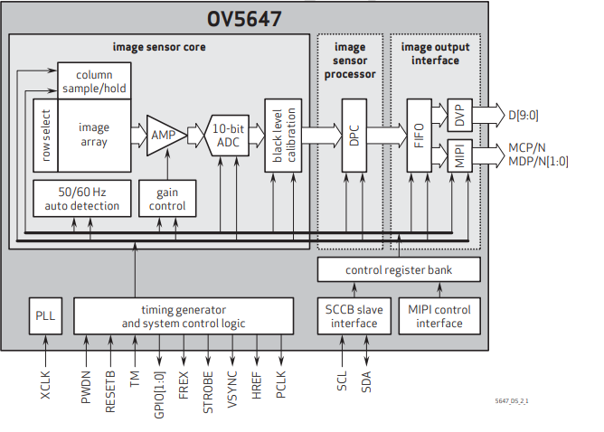

## Officially supported camera sensors in RPI
| Parameters | Omni vision OV5647 | Sony IMX219 |
| ------ | ------ | ---------- |
| Megapixels | 5 | 8 |
| Type of sensor | CMOS | CMOS | 
| Ports on the sensor |SCCB, CSI| CSI-2 |
| Output format | 8 bit/10bit RGB output | 10 bit |
| FPS | 30,45,60,90,120 | 30,60,90 |

## Functional Block Diagram 

The flow of the camera is   
1. driver sends commands via **I2C** and these commands get stored in a control register (memory)   
2. This activates the camera sensor which captures the image and processes it and produces the final output at the **MIPI/CSI** port. 
