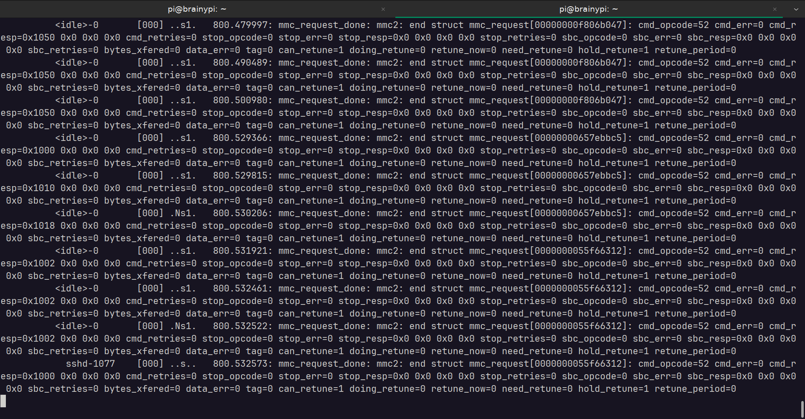

# Event tracing for debugging 

## The problem 

I have a development board [BrainyPi](https://brainypi.com/), WiFi/BT chip on BrainyPi
is RTL8821CS. The chip is connected over SDIO. RTL8821CS support was recently added 
to the mainline kernel. 

I had been trying to run mainline kernel to make the RTL8821CS driver work. The 
problem was that the driver despite loading did not detect RTL8821CS on SDIO. 

## How I used Event tracing to debug SDIO device

When SDIO device is detected it emits a kernel message 
```sh
mmc2 new high speed SDIO card at address 0001
```

This message was not present. 

To check if the mmc commands are being sent to the SDIO used event tracing, 

1.  Enabled the mmc event tracing
    ```sh
    echo 1 | sudo tee /sys/kernel/debug/tracing/events/mmc/mmc_request_done/enable
    ``` 
1.  Filtered the messages with opcode 53 (opcode 53 means the card is working, no need to trace after the card is working) 
    ```sh
    echo 'cmd_opcode != 53' | sudo tee /sys/kernel/debug/tracing/events/mmc/mmc_request_done/filter
    ``` 
1.  On a separate terminal, Monitor the tracing events for `mmc2`
    ```sh
    sudo cat /sys/kernel/debug/tracing/trace_pipe | grep mmc2
    ```
1.  Unbinding the mmc bus to disable the SDIO card
    ```sh
    echo fe31000.mmc | sudo tee /sys/bus/platform/drivers/dmmc_rockchip/unbind
    ```
1.  Bind the mmc bus to enable the SDIO card
    ```sh
    echo fe31000.mmc | sudo tee /sys/bus/platform/drivers/dmmc_rockchip/bind
    ```

    This would help identify any mmc errors while initializing the SDIO card. 

Despite running these commands the SDIO did not get detected. 

## Eventual solution 

The problem was identified when, I check for devices which were yet to be probed. 

Running the command 
```sh
cat /sys/kernel/debug/devices_deferred 
```
showed that the SDIO driver was stuck because external clock was not ready. 

Finally the issue was traced back to incorrect dts entry for clock. 

Fixing it dts entry and repeating the steps shows the correct operation of SDIO card. 



## Conclusion 

Event tracing can be a great tool for debugging, it helps identify why the driver fails 
whithout having to modify the driver code. 

The only downside is that it requires shell access to enable tracing and to check 
the traces. 