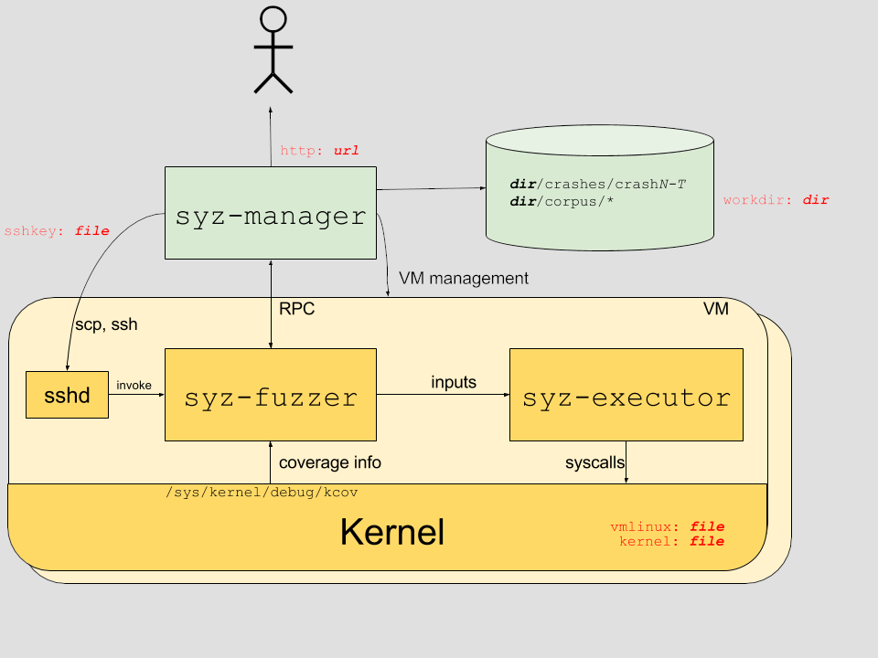

# How to use syzkaller 

Syzkaller is an unsupervised kernel fuzzer that uses both structured fuzzing &
coverage-guided fuzzing techniques to apply fuzzing to kernel syscalls.

## How it works



Manager controls the test system, spwans vm's with fuzzers inside them
which generate small programs which invoke syscalls. 

VM's communication using RPC and log the coverage achieved and trace information
which is stored in the database. 

## Describing syscalls 

Syzkaller has a separate language for Describing syscalls. 

For example: the open() syscall below  

```cpp
int open(const char *pathname, int flags, mode_t mode);
```
is described in syzkaller as: 

```sh
open(file ptr[in, filename], flags flags[open_flags], mode flags[open_mode]) fd
```

-   `file ptr[in, filename]`: the first argument, called file, is an input pointer 
    containing a filename string.
-   `flags flags[open_flags]`: the flags argument is any of the flags defined at 
    open_flags array open_flags = O_WRONLY, O_RDWR, O_APPEND, ...
-   `mode flags[open_mode]`: mode argument is any of the flags defined at 
    open_mode array open_mode = S_IRUSR, S_IWUSR, S_IXUSR, ...
-   `fd`: the return value will be stored here, to be later used on other 
    syscalls.

    for example: 
    ```sh
    read(fd fd, buf buffer[out], count len[buf])
    write(fd fd, buf buffer[in], count len[buf])
    ```

If instead of fd (file descriptior) we want to fuzz integer values from 0 to 500
then we use syntax `int64[0:500]`

syzkaller provides generic descrption for `ioctl()`
```sh
ioctl(fd fd, cmd intptr, arg buffer[in])
```
and also provides specific ones like 
```sh
ioctl$DRM_IOCTL_VERSION(fd fd_dri, cmd const[DRM_IOCTL_VERSION], arg ptr[in, drm_version])
ioctl$VIDIOC_QUERYCAP(fd fd_video, cmd const[VIDIOC_QUERYCAP], arg ptr[out, v4l2_capability])
```

See the refernce below for more. 

Ref: https://github.com/google/syzkaller/blob/master/docs/syscall_descriptions_syntax.md

## Setting up syzkaller 

Follow the steps given here to setup syzkaller - https://github.com/google/syzkaller/blob/master/docs/linux/setup.md

Tips for running syzkaller
1.  Use different defconfigs 
2.  Limit the syscalls to 3-4 chosen, by adding the below in config.config
    ```sh
    "enable_syscalls": [ "ptrace", "getpid" ],
    ```
    
## Fuzzing your patch changes in syzkaller 

If you make a change in kernel and want to fuzz your changes in syzkaller, this 
can be done by following the steps below: 

1.  Modify the kernel and compile. 
2.  Add a new syscall description in syzkaller and generate fuzzers for it. 
3.  Run the syzkaller with new syscall 

### Steps 

1.  Modify the kernel code, for eg : we will modify ptrace syscall 
    ```c 
    diff --git a/kernel/ptrace.c b/kernel/ptrace.c
    index 43d6179508d6..8e4e92931d5f 100644
    --- a/kernel/ptrace.c
    +++ b/kernel/ptrace.c
    @@ -1245,6 +1245,9 @@ SYSCALL_DEFINE4(ptrace, long, request, long, pid, unsigned long, addr,
         struct task_struct *child;
         long ret;
 
    +    if (pid == 0xdeadbeaf)
    +            BUG();
    +
         if (request == PTRACE_TRACEME) {
             ret = ptrace_traceme();
             if (!ret)
    ```
    
    The compile the kernel with modified code. 
1.  Navigate to the syzkaller dir and modify the file `sys/linux/sys.txt`
    ```sh
    ptrace$broken(req int64, pid const[0xdeadbeaf])
    ```

1.  Generate fuzzer for the new syscall 
    ```
    make bin/syz-extract
    ./bin/syz-extract -os=linux -sourcedir=$KSRC -arch=amd64 sys.txt
    make generate
    make
    ```
    -   Note: I was not able to do this step because it gives errors. 
        


1.  Enable the newly added syscall in config.cfg 
    ```json
    "enable_syscalls": [ "ptrace$broken"]
    ```

1.  Run syzkaller
    ```sh
    ./bin/syz-manager -config=config.cfg
    ```

## Fuzzing complex subsystems in kernel 

-   Syzkaller comes with set of system calls for linux -
    https://github.com/google/syzkaller/tree/master/sys/linux
-   Some subsystems are better supported (like USB, socket-related syscalls) 
    than others. 
-   To fuzz these complex sub-systems, we use a combination of techniques like,
    1.  Using syzkaller resources to, define an order to syscalls and to store 
        the device state and data. 
    1.  Using udev (in rfs) to symlink drivers so that a particular driver is 
        targeted by the syzkaller. (Syzkaller may not be able to send syscalls
        to `/dev/video0` so syzkaller sends it to `/dev/vim2m` which is symlinked 
        to video0 )
    1.  Using pseudo-syscalls - Allows syzkaller to run custom c functions defined 
        as pseudo-syscalls. 


