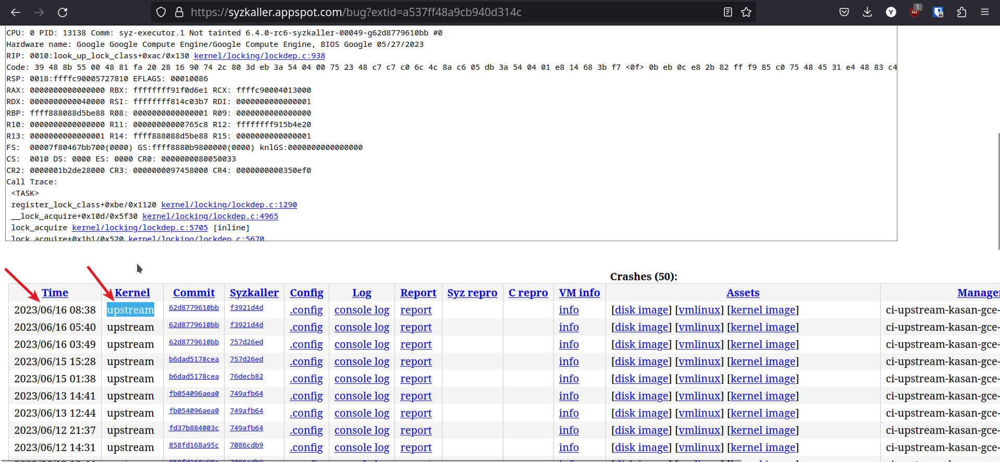
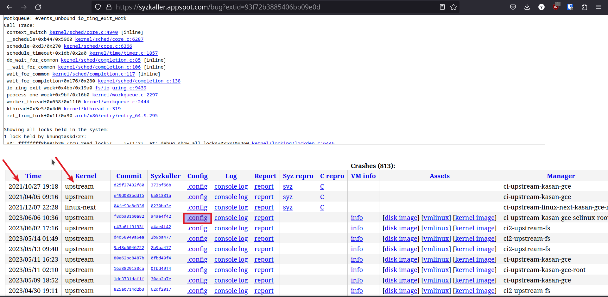
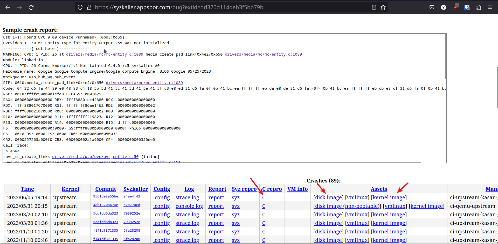
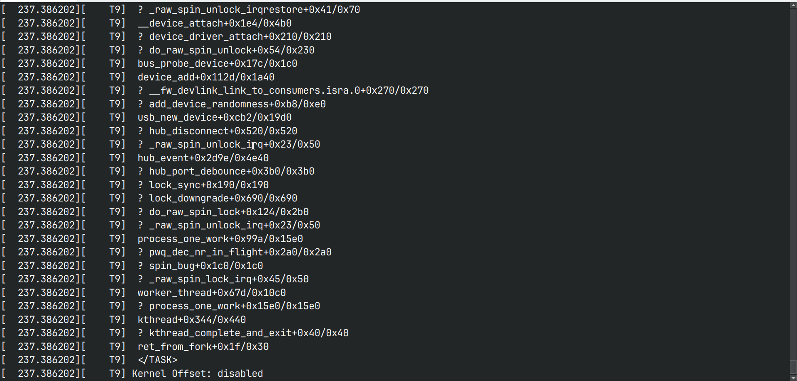
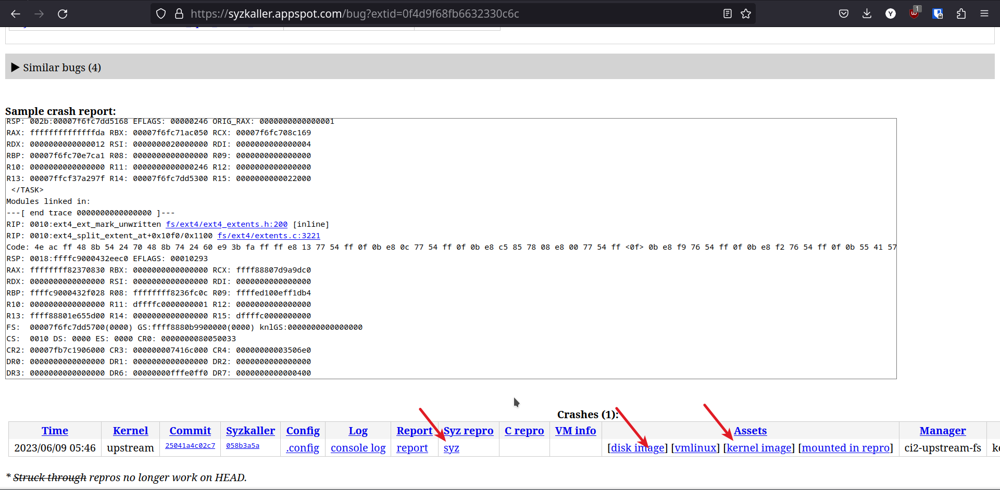

# How to reproduce bugs from syzkaller 

## Case 1: If you have a C reproducer

1.  Navigate to the syzkaller bug link 
    1.  If the bug is found in the upstream kernel 
        
         

        then download the kernel-image from the link using `wget` 
    
    2.  If the bug is found not on the upstream kernel, then it is best 
        to download the `.config` file and build the latest upstream kernel 

         

1.  Now that the kernel is downloaded and ready, download these artifacts too. 
    -   disk image 
    -   C repro, save as `.c` file 

     

2.  Extract the disk image and kernel image 
    ```sh 
    $ xz --decompress <disk-image> 
    $ xz --decompress <kernel-image> 
    ```
3.  Start VM, by running commands 
    ```sh
    $ export KERNEL_IMG=<full-path-to-kernel-image>
    $ export RFS_IMG=<full-path-to-disk-image>

    $ qemu-system-x86_64 -m 2G -smp 2 -kernel ${KERNEL_IMG} -append "console=ttyS0 root=/dev/sda1 earlyprintk=serial net.ifnames=0" -drive file=${RFS_IMG},format=raw -net user,host=10.0.2.10,hostfwd=tcp:127.0.0.1:10021-:22 -net nic,model=e1000 -enable-kvm -nographic -pidfile vm.pid 2>&1 | tee vm.log
    ```
4.  Compile the C repro file  
    ```sh
    $ gcc -o repro1 repro1.c 
    ```
    **Note**: Cross compile for arch other than x86_64

5.  Copy the compiled executable file into vm 
    ```sh 
    $ scp -P 10021 -r ./repro1 root@localhost:~/  
    ```

6.  SSH into the VM and run the compiled program 
    ```sh 
    $ ssh root@localhost -p 10021 
    # ./repro1 
    ```

7.  If the bug is not fixed then it will give a kernel panic. 

     

8.  If there is no panic then the bug has been fixed. 


### Case 2: If you have a Syz reproducer

1.  Navigate to the syzkaller bug link 
    1.  If the bug is found in the upstream kernel 
        
         

        then download the kernel-image from the link using `wget` 
    
    2.  If the bug is found not on the upstream kernel, then it is best 
        to download the `.config` file and build the latest upstream kernel 

         

1.  Now that the kernel is downloaded and ready, download these artifacts too. 
    -   disk image 
    -   syz repro, save as `.txt` file 

         

2.  Extract the disk image and kernel image 
    ```sh 
    $ xz --decompress <disk-image> 
    $ xz --decompress <kernel-image> 
    ```
3.  Start VM, by running commands 
    ```sh
    $ export KERNEL_IMG=<full-path-to-kernel-image>
    $ export RFS_IMG=<full-path-to-disk-image>

    $ qemu-system-x86_64 -m 2G -smp 2 -kernel ${KERNEL_IMG} -append "console=ttyS0 root=/dev/sda1 earlyprintk=serial net.ifnames=0" -drive file=${RFS_IMG},format=raw -net user,host=10.0.2.10,hostfwd=tcp:127.0.0.1:10021-:22 -net nic,model=e1000 -enable-kvm -nographic -pidfile vm.pid 2>&1 | tee vm.log
    ```
5.  Copy the files `syz-executor` `syz-execprog` and `syz.txt` into vm 
    ```sh 
    $ scp -P 10021 -r <path-to-syzkaller>/syzkaller/bin/linux_amd64/syz-executor <path-to-syzkaller>/syzkaller/bin/linux_amd64/syz-execprog ./syz.txt root@localhost:~/ 
    ```
    **Note**: files `syz-executor` and `syz-execprog` are part of syzkaller, 
    for this you have to compile the syzkaller on your machine. For instructions 
    on compiling syzkaller see [link](https://github.com/google/syzkaller/blob/master/docs/linux/setup.md)

6.  SSH into the VM and run the command 
    ```sh 
    $ ssh root@localhost -p 10021 
    # ./syz-execprog -executor=./syz-executor -repeat=0 -procs=12 -cover=0 ./syz.txt 
    ```

7.  If the bug is not fixed then it will give a kernel panic. 

     

8.  If there is no panic then the bug probably has been fixed. 
