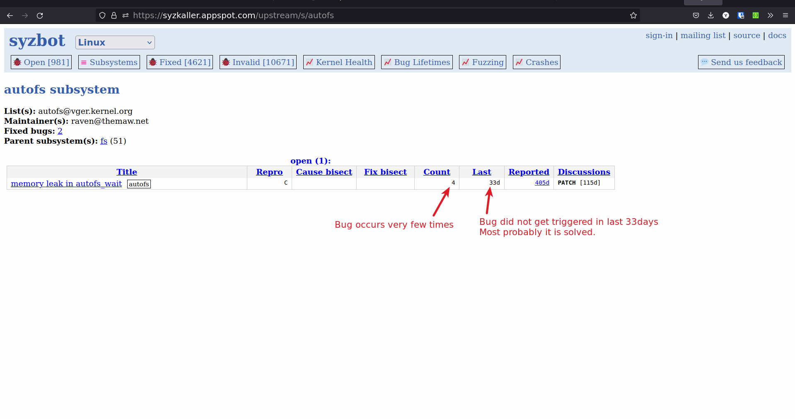
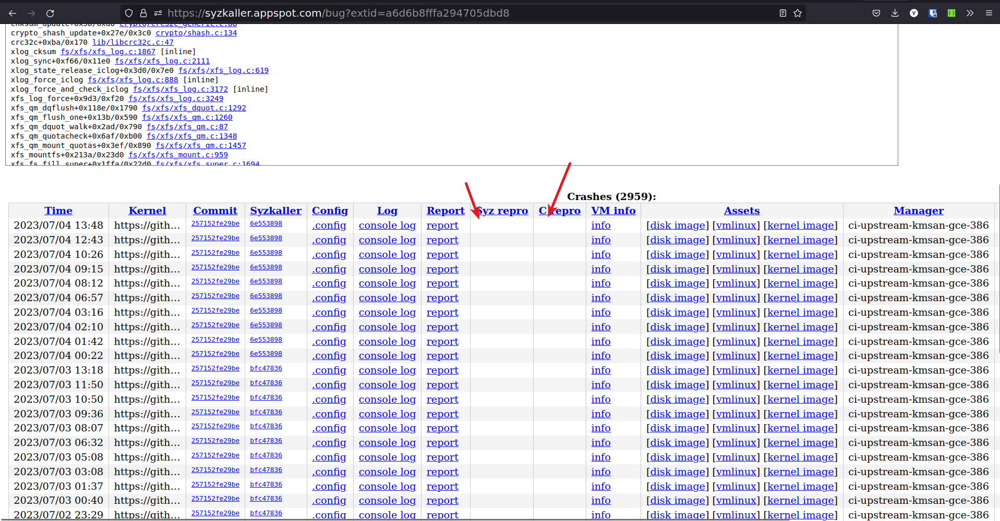
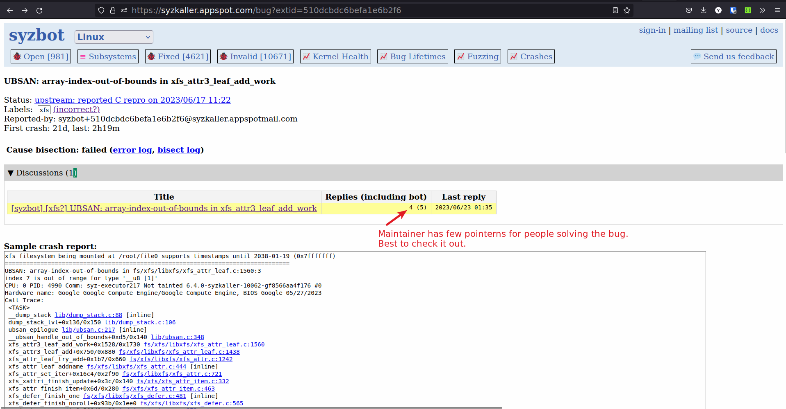
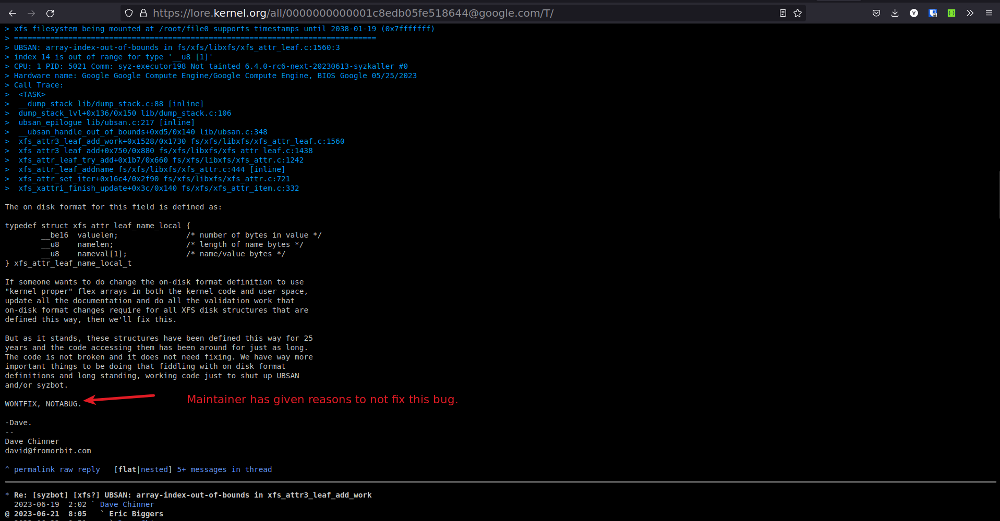
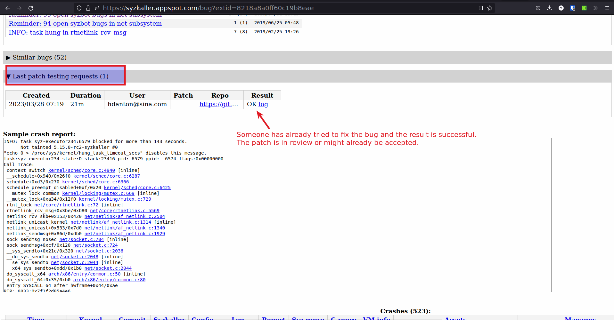

# Solving syzkaller bugs 

## Mistakes I made while choosing bugs to solve from syzkaller

1.  I started by choosing a subsystem and trying to solve bugs from that subsystem. 

    

    -   The problem with approach is
        1.  Some subsystems have very few bugs (eg: i2c) and most of these bugs are trivial or 
        2.  Some subsystems have very active contributers, who solve the bugs within few days of occuring,
            competing with them becomes hard. 

    -   Don't limit yourself to one subsystem, try to solve bugs and help improve the code. 
        You may have to learn and understand different subsystems, but that is what makes this fun. 

1.  Choosing bugs which do not have C or syz reproducers 

    

    -   It is very hard to reproduce a bug locally without C or syz reproducers. 
        If you cannot reproduce then chance of solving the bug becomes very small. 

1.  Reproducers are for old kernel versions 

    

    -   Again you may not be able to reproduce the bug. 

1.  Choosing bugs which last occured more than 30 days 

    

    -   If the bug is not occuring for more that 30 days then it is probably solved. 

1.  Choosing bugs which are marked WONTFIX or a false positive. 

    -   Some bugs are false positives or some bugs the subsystem maintainer does not want to solve `WONTFIX`. 
        
        
        
        

    -   False positive patches will get rejected. 
    -   For WONTFIX bug, you may have to give a solid reason why this patch needs to be accepted. 

1.  Choosing bugs for which the patches are work in progress or have been submitted but not accepted. 

    -   You will see that someone has already test their patch in syzkaller and will most likely 
        submit the patch or the patch is in review. 
        
        

    -   90 % times the patches will get accepted, hence treat these bugs as solved bugs. 


## Process for solving a syzkaller bug 

1.  Choosing the right bug to solve 
    -   [X] Bug should be recent (Last < 7d)
    -   [X] Syz reproducer exists for the upstream (latest) version of the kernel. 
    -   [X] Disk and kernel image exists for the bug. 
    -   [X] .config file exists for the bug. 
    -   [X] Last patch testing requests is empty or last patches testing all failed. 
    -   [X] Check the Discussions to see if the bug is not marked as WONTFIX or NOTABUG 


2.  Try to reproduce the bug on the latest kernel 
    1.  Download the .config file from [syzkaller](https://syzkaller.appspot.com)
    1.  Download the latest kernel 
        ```sh
        git clone git://git.kernel.org/pub/scm/linux/kernel/git/torvalds/linux.git -b master
        ```
    1.  Compile the kernel with the .config file
    1.  Download the Disk image from [syzkaller](https://syzkaller.appspot.com)
    1.  Run the kernel with disk image by using the script below 

        ```sh
        #!/bin/bash

        KERNEL_IMG_PATH=$1
        RFS_IMG_PATH=$2

        qemu-system-x86_64 \
            -m 2G \
            -smp 2 \
            -kernel ${KERNEL_IMG_PATH} \
            -append "console=ttyS0 root=/dev/sda1 earlyprintk=serial net.ifnames=0 nokaslr" \
            -drive file=${RFS_IMG_PATH},format=raw \
            -net user,host=10.0.2.10,hostfwd=tcp:127.0.0.1:10021-:22 \
            -net nic,model=e1000 \
            -enable-kvm \
            -nographic \
            -pidfile vm.pid \
            2>&1 | tee vm.log
        ```

        ```sh
        # usage 
        ./run-vm.sh ./bzImage ./disk-image.img
        ```
    1.  Follow the steps in the [doc](./Reproducing-bugs-from-syzkaller.md) to reproduce the bug. 

        -   Syz reproducer is preffered over C reproducer. 


3.  Solve the bug, Use the tools and techniques from the [doc](./Tools-and-Techniques-to-Debug-an-Linux-System.md) 
    to solve the bug. 


4.  Test the patch localy, by following the step 2. 

5.  Send the patch for testing to syzkaller. 
    1.  Send an email to syzbot `syzbot+a6d6b8fffa294705dbd8@syzkaller.appspotmail.com` and syzkaller google groups (syzkaller-bugs@googlegroups.com). 
    1.  Email body should have 
        ```sh
        #syz test: <git rep> <git repo branch>

        =================================

        Your patch 

        ```

        **Note**: It is better to send patch as attachment rather than inline, but I have not figured out how to do it yet. 

6.  Check if the test by syzkaller is ok.

7.  Send the patch to the subsystem maintainer.