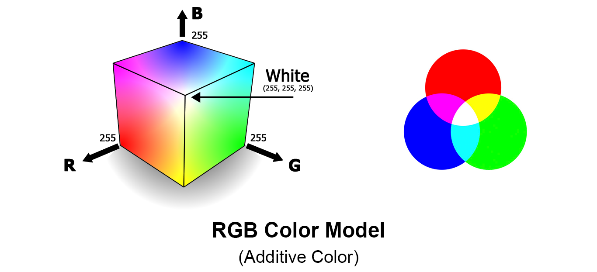

# Understanding Types of Image representation 
1. Vector Image - Vector images are represented to the computer in a form of an recipe on how to draw the image.

It is resolution independent.
For example : 
```
draw circle
     center        0.5, 0.5
     radius        0.4
     fill-color    yellow
     stroke-color  black
     stroke-width  0.05
draw line
     start         0.3, 0.6
     end           0.7, 0.6
     stroke-color  black
     stroke-width  0.1
```

2. Raster Image - Raster images are represented in a an array where each element is called a pixel.


Normally we deal with raster images.


# Black and White Image 
Now each pixel in a (Raster) Image is represented using 1/0 (1 bit) then we will get an image which is black and white with no color.


# Color Image 
Turns out you can build any color using the right amounts of Red, Green and 
Blue colors. Thus each pixel in a (raster) image can be represented in amount 
of red, green and blue to represent a color.



# How are images represented in a computer 
Raster images are an array of pixels, each of these pixels are represented using n-bits for black & white and for color using n-bits per color. 

Lets say you use 24 bit to represent these pixels then the image will look like this 


### Additional Reference 
1. https://www.youtube.com/watch?v=15aqFQQVBWU


# Color Space 
Most used color spaces are 
1. RGB - All colors can be represented using Red Green and Blue
2. YCbCr - RBG is not good for compression, and humans are more attuned to Brightness (luminance) and difference between 2 colors (Chrominance). 

Hence this creates a new color space where the image is Represented in YCbCr 
instead of RBG.

Where, Y is brightness and Cb, Cr is Chrominance 
Y = 0.299r' + 0.587g' + 0.114b' (Brightness or luminance)
Cb = (b'-y)/1.772 (Chrominance)
Cr = (r'-y)/1.402 (Chrominance)


# Properties of Image

## Image Resolution 
Image Resolution is the detail that the image holds. More resolution more 
detailed the image.

It can also be translated to Pixel Resolution.

Pixel Resolution is the number of pixels the image contains.
Pixel resolution is represented in 2 formats 
1. height x width i.e. 640 x 320 pixels or 1920 x 1080 pixels
2. total number of pixels i.e 2 Mega pixels or 5MP etc..

### Aspect Ratio 
The Ratio of the height and width of the image.
Eg : 1:1 (square image)


## Bit Depth 
It is the How many number of bits used to represent each pixel in an image.
More bit depth that means more shades of colors are possible.

## Brightness
We all know what it is, but still for the sake of it.
Brightness is the intensity of light in an image. 

## Contrast 
Contrast is difference in brightness and color of the objects in the same picture.

Take this example.


The left side of the image has low contrast and the right side of the image has high contrast.

## Saturation 
Saturation is the perceived intensity. In other words it is a value of how dominant the color is, or how colorful the object looks.

## Sharpness 
Sharpness defines how quickly image transforms at the edge.


The left side of the image is sharp while the right side of the image is soft.

# Image storage formats

## Un-compressed 
Image is stored 'as-is' without any changes 

1. RAW -  Typically the output image from the camera 


## Compressed
Image is processed to reduce size and then stored.

1. JPEG - lossy form of compression of the image. After compression image size is reduced but the quality of the image is reduced.

2. PNG - lossless form of compression. After conversion the image size gets reduced but image quality stays the same.
