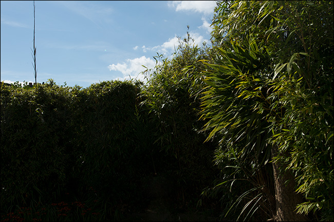
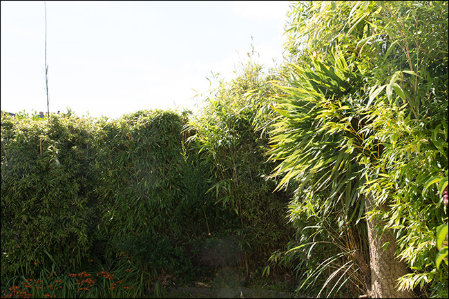
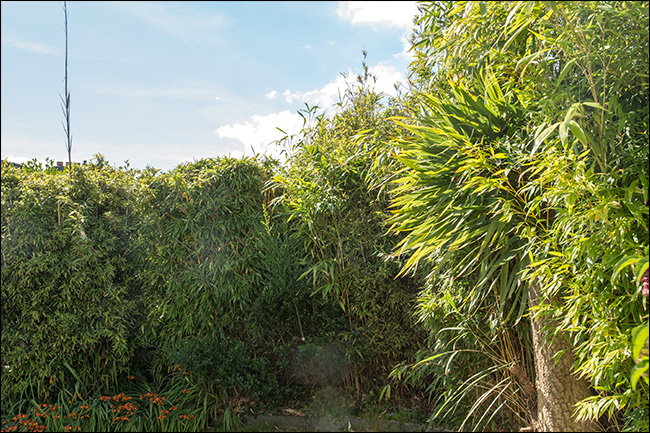

# Working of CMOS Camera sensor

1. The light enters when shutter of the camera gets opened through lens and then it is stored in the form of photons.
2. Then these photons are converted into some electric signals having certain range of voltage say 0 to 5 V.
3. The brighter the light, the more photons are collected, and a higher electrical charge is generated.
4. Electric Voltage only denotes the brightness (light intensity) of the image.
5. In order to make this image colorful a color filters are put on top of the sensor so that only one chosen colored light passes through. 
6. Hence each sensor provides brightness (light intensity) for one color as output.
7. The RGB value of one pixel comes from combined outputs of 4 photodiodes.  
8. This is due to each pixel has 4 photodiodes in which 2 are of green filter and one of red filter and blue filter each. 
9. All Combined we get RGB output for each pixel.

# Parameters to measure camera sensor Performance 

## Dynamic Range 
Dynamic Range is the ability of the camera to capture both light tones and dark tones without losing the other.

For example :

1. Sky is clear but the bushes are dark 

----

2. Bushes are clear but the sky is very bright 

----

3. Actually how it looks to the human eye.

Dynamic Range is measured in **stops**. Human eye has Dynamic range of upto 20 
stops, best camera has range upto 15 stops. 

Higher the better performance of the camera.

## Signal to Noise Ratio
Ratio of signal power to noise power. Where Signal means valuable data or info and noise means unused data or info.

It is measured in db. 

Higher the better performance of the camera.

## Low Light Sensitivity 
Low-light sensitivity for cameras is defined as the lowest level of light that still provides reasonable image clarity. 

It is measured in lux.

Lower the better performance of the camera.
