# Basics of Photography 
These are key points of photography which allows you to take great photos 

## Exposure 
Exposure is the amount of light that is exposed to the camera sensor.

If too much light is exposed the photo will be very bright and too little light is exposed then the photo will be too dark.

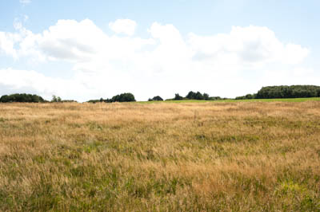
1. Over exposed image

----

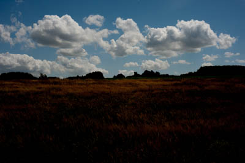

2. Under exposed image 

---

Exposure can be controlled by two parameters 
1. ISO
2. Shutter speed

## Depth of Field 
The ability of the camera to focus on many different objects in one frame.

Higher depth of field camera can focus on objects both near and far away.

----
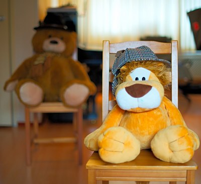
1. Smaller Depth of Field

----
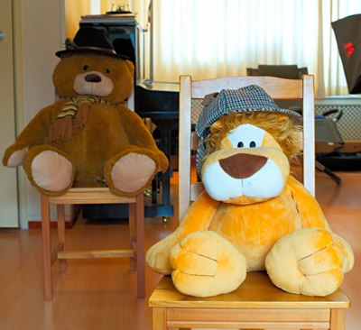
2. Large Depth of Field 

----

## White Balance 
White balance is removing unrealistic colors from the image. These unrealistic colors are added due to varying light conditions in the nature.

---
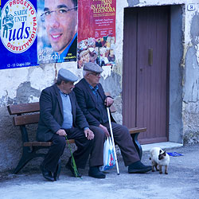

1. Incorrect White Balance 
---

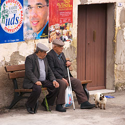

2. Correct White Balance 
---

# Camera Sensor Parameters 

## Shutter Speed 
Shutter speed is the **length of time** for which the shutter is open and camera captures light. It is measured in fractions of seconds i.e. 1/20, 1/30, 1/100 etc.

You want to capture more light then use a longer shutter speed.

----
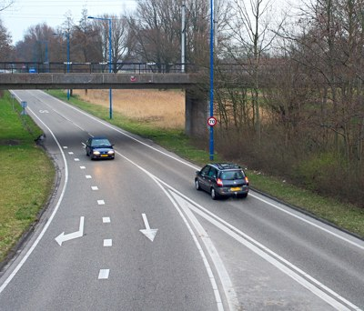

1. Fast Shutter speed 
----

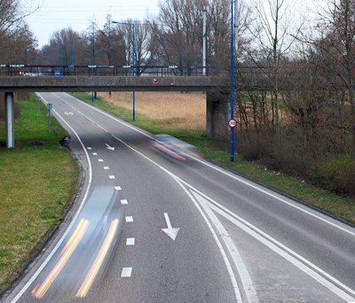

2. Slow shutter speed - causes motion blur.
----

## ISO
ISO is the sensitivity of the camera to light.

Higher the ISO the more light gets captured. But it has a drawback it adds more noise to the image.

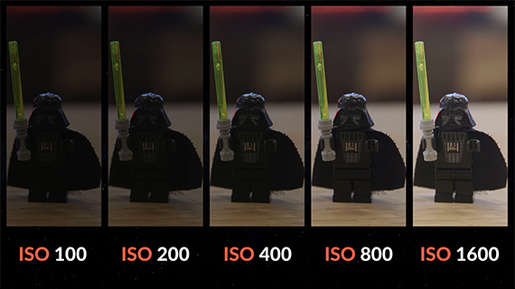

More ISO the image gets brighter, but the image will also get grainy. 

# Lens parameters 

## Aperture 
Aperture is the size of the hole in the lens through with light travels to the camera.

Aperture is measured in focal lengths like f/32, f/16, f/11, etc.. 

```
f/32 - Hole size is small --> Deep Depth of field 
...
f/1.4 - Hole size is large  --> Shallow Depth of field
```

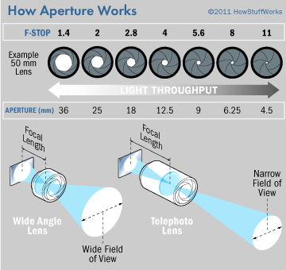

## Focal length 
Focal length is the measure of the "how wide the lens can capture an image." or angle of view of the image.

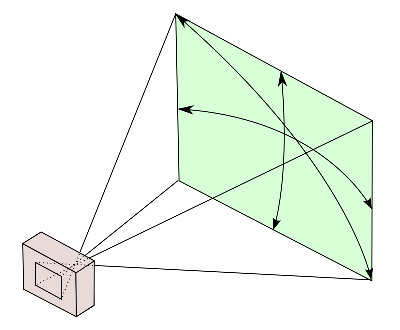

# Choosing the Best options for all of these.

This Flow cart will help you choose the best suitable options 
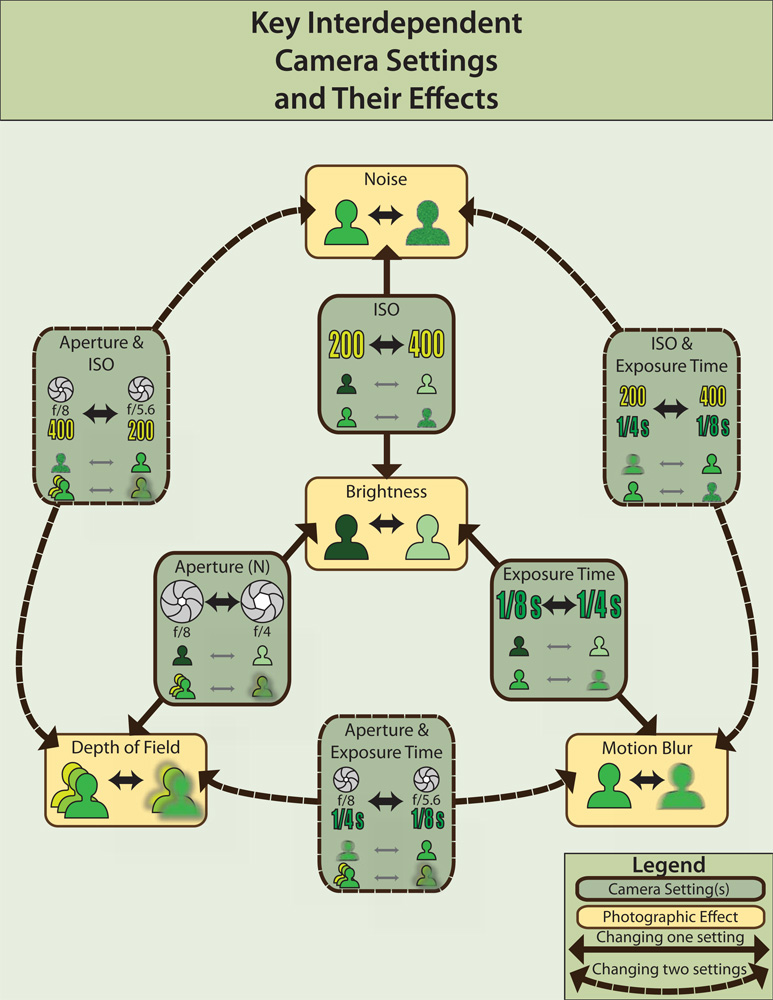
