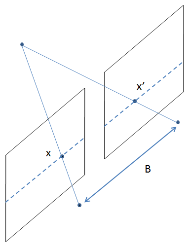

# Projection Matrix
```
1/f = 1/do + 1/di
```
Where,  
f => Focal Length of the camera   
d0 => Distance of the object from the lens  
di => Distance b/w the lens and the image plane (camera sensor)  

since do >> di hence we can say that the image plane (camera sensor) is at the 
focal length  

Hence by the law of similar triangles we can say that   
```
hi = f x ho/do
```
Where,   
hi = height in the image   
f = focal length   
ho = height of the object   
do = distance of the object   

So we can say that the an point 3D in X,Y,Z co-ordinates gets converted to a point   
in 2D co-ordinate as x,y.  

The Matrix that it forms is 
```
  [x]   [f 0 0] [X]
S [y] = [0 f 0] [Y] 
  [1]   [0 0 1] [Z]
                [1]
```
This is projection matrix. 
And where the frame is not aligned with the focal point we add the rotation and translation matrix

Hence we get camera intrinsic properties in (focal length etc) in one matrix and 
extrinsic properties (rotation and translation) in one matrix.


# Epipolar Geometry 


Lets say you are capturing images using 2 cameras. (stereo vision)

The blue plane in the above picture is the images captured by camera left and camera right respectively.

OL => center of the left camera  
OR => Center of the right camera  

And we are trying to capture the object X.

Now we will discuss the terms 
1. Epipolar plane - The plane getting formed by joining the centers of the cameras and the object is called as epipolar plane.

2. Epipolar line - The line OL-X is actually a `point for camera left` but a `line for camera right` since the viewing angles changed. Hence this line (line er-Xr ) is called as Epipolar line.

# Detecting Depth from Stereo images 



Lets say we have 2 cameras side by side with same 3D calibration (i.e 0 rotation and B translation X domain) 

Then the projection Matrix of the Right camera is 
  

Where, 
f - Focal length of the camera 
X,Y,Z - Real World co-ordinates of the object
B - Is the distance between the centers of the 2 cameras 
u0, v0 - are the x,y co-ordinates of the Principle point.
x',y' - is the co-ordinates of the object in the image  

And the To calculate depth we can use this formula


The term (x-x') is called as `disparity`. 

Disparity can be calculated using available OpenCV functions 
```c
//Compute disparity 
cv::Mat disparity; 
cv::Ptr<cv::StereoMatcher> pStereo =  
cv::StereoSGBM::create(0,   //minimum disparity 
                        32,  //maximum disparity 
                        5);  //block size 
pStereo->compute(rectified1, rectified2, disparity); 
```

This will give us the value of (x-x') then we can multiply it by focal length of the right camera and the distance between the Centers of the camera will give you the Real world Depth of the point.


## Practical 
I Could not do a practical fully because of I could not capture Stereo images of an object. For now I am moving this to TODO.

Practical Reference - https://albertarmea.com/post/opencv-stereo-camera/

## References 
1. https://www.pyimagesearch.com/2015/01/19/find-distance-camera-objectmarker-using-python-opencv/
