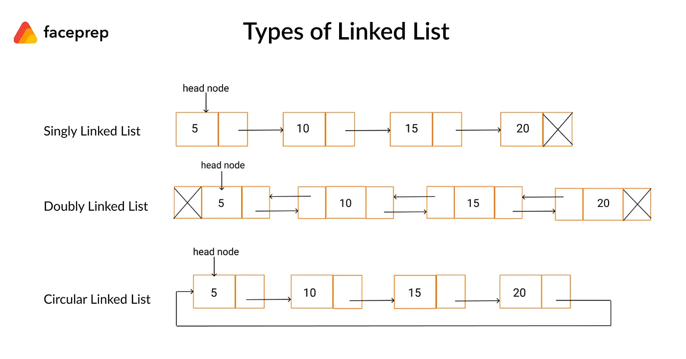

## Linked List 
Linked List is collection of elements but they are not stored in consecutive manner like an array.

-   Array is limited by the size defined at the start. 
-   Array is not memory efficient i.e if the size is 10 and only 2 elements are stored then 8 elements worth of memory is allocated but not used.


### Declaration 

```c
struct Node {
    int data; 
    struct Node *next;
};
```

### Types 
1.  **Singly Linked List**: One node only points to next node and the end node points to NULL.
2.  **Doubly Linked List**: One node points to 2 nodes, previous and next.
3.  **Circular Linked List**: Singly Linked List but last node points to the fist node. 
4.  **Doubly Circular Linked List**: Doubly Linked List but last node points to first node and first node also points to last node.



## Complexity 

Type | Access | Search | Insertion | Deletion
--- | --- | --- | --- | ---
Signly Linked List (Avg) | O(n) | O(n) | O(1) | O(1)
Signly Linked List (Worst) | O(n) | O(n) | O(1) | O(1)

## Singly Linked List 

Working C code for Singly linked List and its operations

```c
#include <stdio.h>
#include <stdlib.h>
#include <stdint.h>

// Singly linked list 

struct Node {
  int data; 
  struct Node *next;
};

int insert (struct Node **head, int data) {
    struct Node *node = (struct Node *) malloc(sizeof(struct Node));
    if(NULL == node) {
        printf("failed to allocate memory");
        return -1;
    }
    node->data = data; 
    node->next = *(head); 
    *(head) = node;
    
    return 0;
}

int insertAt (struct Node **head, int data, int loc) {
    
    if(loc == 0) {
        insert(head, data);
    } else {
        struct Node *curr = NULL;
        struct Node *prev = NULL;
        unsigned int count = 0;
        curr = *(head);
        while(curr->next != NULL) {
            if(count == loc) {
                struct Node *node = (struct Node *) malloc(sizeof(struct Node));
                if(NULL == node) {
                    printf("failed to allocate memory");
                    return -1;
                }
                node->data = data;
                node->next = curr;
                prev->next = node;
                break;
            }
            prev = curr;
            curr = curr->next; 
            count++; 

        }
    }
    return 0;
}

int append (struct Node **head, int data) {
    struct Node *node = (struct Node *) malloc(sizeof(struct Node));
    struct Node *index = *(head);
    if(NULL == node) {
        printf("failed to allocate memory");
        return -1;
    }
    
    // Traverse to the end of list 
    while(index->next != NULL) {
        index = index->next;
    }
    
    node->data = data; 
    node->next = NULL; 
    index->next = node;
    
    return 0;
}

void deleteTop(struct Node **head) {
    struct Node *node = NULL;
    node = *(head); 
    *(head) = node->next;
    free(node);
}
void deleteBottom(struct Node **head) {
    struct Node *curr = NULL;
    struct Node *prev = NULL;
    curr = *(head); 
    // Traverse to the end of list 
    while(curr->next != NULL) {
        prev = curr;
        curr = curr->next;
    }
    free(curr); 
    prev->next = NULL; 
}
void deleteAt(struct Node **head, int data) {
    struct Node *curr = NULL; 
    struct Node *prev = NULL;
    struct Node *next = NULL;
    unsigned int count = 0;
    curr = *(head);
    while(curr != NULL) {
        next = curr->next; 
        if (curr->data == data) {
            if(prev == NULL) {
                // Delete top 
                deleteTop(head); 
            }else {
                prev->next = next; 
                free(curr); 
            }
 
        }
        prev = curr; 
        curr = next;
    }
}

void freeList(struct Node **head) {
    struct Node *curr = NULL; 
    struct Node *next = NULL;
    curr = *(head);
    while(curr != NULL) {
        next = curr->next;
        free(curr); 
        curr = next;
    }
}

void printList (struct Node **head) {
    struct Node *node = NULL; 
    node = *(head);
    while(node != NULL) {
        printf("%d, ", node->data); 
        node = node->next;
    }
}

int main () {
    
    struct Node *head = NULL;
    if(insert(&head, 1) != 0) {
        printf("Insert failed");
    }
    if(append(&head, 2) != 0) {
        printf("Insert failed");
    }
    if(append(&head, 3) != 0) {
        printf("Insert failed");
    }
    if(append(&head, 4) != 0) {
        printf("Insert failed");
    }
    if(append(&head, 5) != 0) {
        printf("Insert failed");
    }
    if(append(&head, 6) != 0) {
        printf("Insert failed");
    }
    if(append(&head, 7) != 0) {
        printf("Insert failed");
    }
    deleteTop(&head);
    deleteBottom(&head);
    deleteAt(&head, 3);
    printList(&head);
    if(insertAt(&head, 10, 2) != 0) {
        printf("Insert failed");
    }
    printList(&head); 
    freeList(&head);
    return 0;
}

```